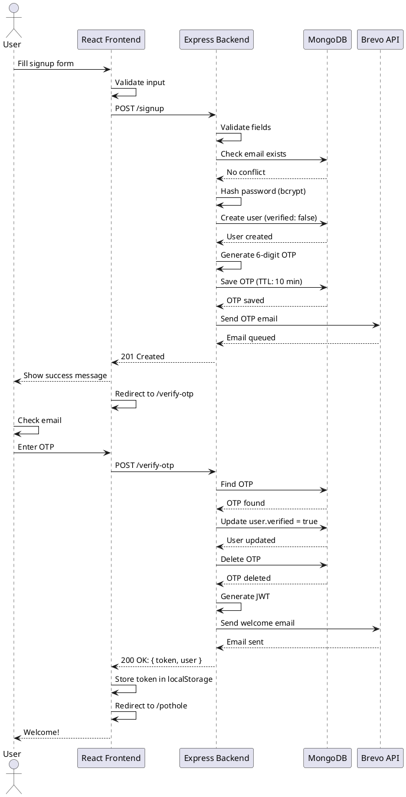
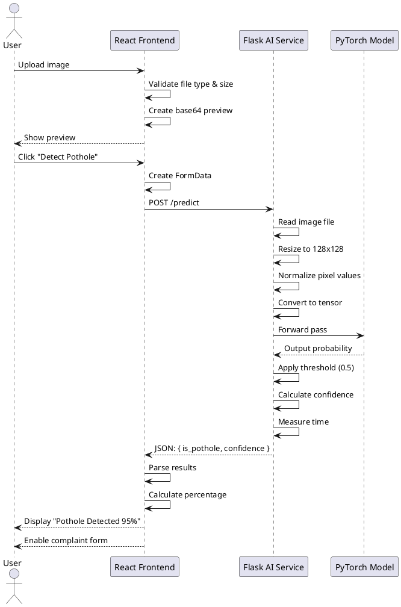
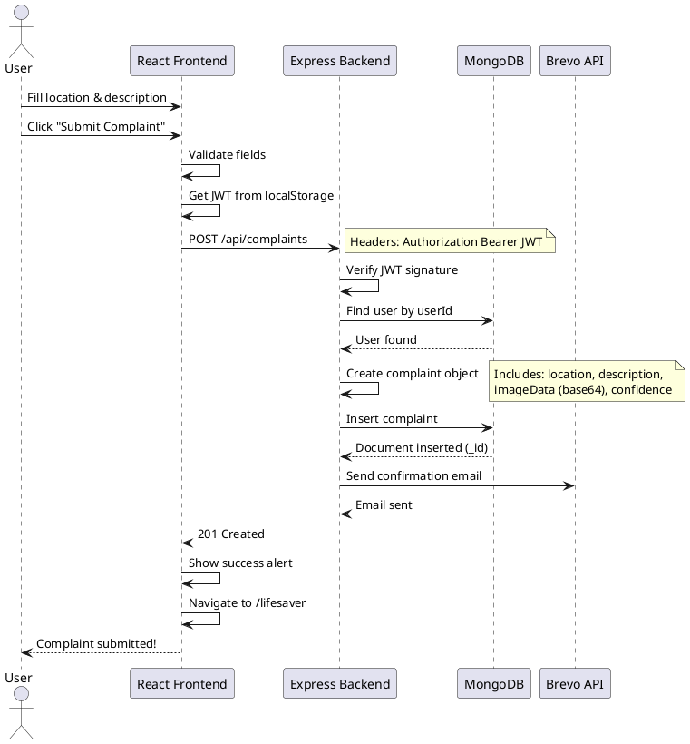

# Sequence Diagrams - AI-Powered Pothole Detection System

**Document Version:** 1.0  
**Date:** November 18, 2025  
**Project:** AI-Powered Pothole Detection & Reporting System

---

## Table of Contents

1. [User Registration with OTP](#1-user-registration-with-otp)
2. [Email/Password Login](#2-emailpassword-login)
3. [Google OAuth Authentication](#3-google-oauth-authentication)
4. [Microsoft OAuth Authentication](#4-microsoft-oauth-authentication)
5. [Pothole Image Detection](#5-pothole-image-detection)
6. [Complaint Submission with Image](#6-complaint-submission-with-image)
7. [Complete End-to-End Flow](#7-complete-end-to-end-flow)
8. [Error Handling Scenarios](#8-error-handling-scenarios)

---

## 1. User Registration with OTP

### Sequence Diagram

```
Actor: User
Participant: React Frontend
Participant: Express Backend
Participant: MongoDB
Participant: Brevo Email API

User -> React Frontend: 1. Fill signup form (name, email, password)
React Frontend -> React Frontend: 2. Validate input (email format, password length)
React Frontend -> Express Backend: 3. POST /signup
Note over Express Backend: Request body: { name, email, password }

Express Backend -> Express Backend: 4. Validate request fields
Express Backend -> MongoDB: 5. Check if email exists
MongoDB --> Express Backend: 6. Return user query result

alt Email already exists and verified
    Express Backend --> React Frontend: 7a. 409 Conflict: "Email already registered"
    React Frontend --> User: 8a. Show error message
else Email exists but unverified
    Express Backend -> Express Backend: 7b. Allow re-registration
end

Express Backend -> Express Backend: 8. Hash password (bcrypt, 12 rounds)
Express Backend -> MongoDB: 9. Create User document
Note over MongoDB: { name, email, hashedPassword, verified: false }
MongoDB --> Express Backend: 10. User created successfully

Express Backend -> Express Backend: 11. Generate 6-digit OTP
Express Backend -> MongoDB: 12. Save OTP with TTL (10 min)
Note over MongoDB: OTP Collection: { email, hashedOTP, expiresAt }
MongoDB --> Express Backend: 13. OTP saved

Express Backend -> Brevo Email API: 14. Send OTP email
Note over Brevo Email API: POST /v3/smtp/email
Note over Brevo Email API: Template: HTML with OTP code
Brevo Email API --> Express Backend: 15. Email queued (202 Accepted)

Express Backend --> React Frontend: 16. 201 Created: "User registered! Check email"
React Frontend --> User: 17. Show success message
React Frontend -> React Frontend: 18. Redirect to OTP verification page

User -> User: 19. Check email inbox
User -> User: 20. Copy 6-digit OTP

User -> React Frontend: 21. Enter OTP on verification page
React Frontend -> Express Backend: 22. POST /verify-otp
Note over Express Backend: Request body: { email, otp }

Express Backend -> MongoDB: 23. Find OTP document
MongoDB --> Express Backend: 24. Return OTP record (or null if expired)

alt OTP invalid or expired
    Express Backend --> React Frontend: 25a. 400 Bad Request: "Invalid OTP"
    React Frontend --> User: 26a. Show error with resend option
else OTP valid
    Express Backend -> MongoDB: 25b. Update user.verified = true
    MongoDB --> Express Backend: 26b. User updated
    
    Express Backend -> MongoDB: 27. Delete used OTP
    MongoDB --> Express Backend: 28. OTP deleted
    
    Express Backend -> Express Backend: 29. Generate JWT token (24h expiry)
    Note over Express Backend: jwt.sign({ userId }, JWT_SECRET)
    
    Express Backend -> Brevo Email API: 30. Send welcome email
    Brevo Email API --> Express Backend: 31. Email sent
    
    Express Backend --> React Frontend: 32. 200 OK: { token, user }
    React Frontend -> React Frontend: 33. Store token in localStorage
    React Frontend -> React Frontend: 34. Update auth state (setIsLoggedIn)
    React Frontend -> React Frontend: 35. Redirect to /pothole
    React Frontend --> User: 36. Show welcome message
end
```

### Key Points

- **OTP Generation:** 6-digit random number, hashed before storage
- **OTP Expiry:** Automatic deletion after 10 minutes via MongoDB TTL index
- **Password Security:** bcrypt with 12 salt rounds
- **JWT Token:** HS256 algorithm, 24-hour expiration
- **Email Template:** HTML formatted with project branding

### Error Scenarios

| Error | Status Code | User Action |
|-------|-------------|-------------|
| Email already exists | 409 | Redirect to login |
| Invalid email format | 400 | Show inline error |
| Weak password | 400 | Show password requirements |
| OTP expired | 400 | Offer resend OTP button |
| Email service down | 500 | Log error, show generic success |

---

## 2. Email/Password Login

### Sequence Diagram

```
Actor: User
Participant: React Frontend
Participant: Express Backend
Participant: MongoDB

User -> React Frontend: 1. Fill login form (email, password)
React Frontend -> React Frontend: 2. Validate input (non-empty fields)
React Frontend -> Express Backend: 3. POST /login
Note over Express Backend: Request body: { email, password }

Express Backend -> Express Backend: 4. Validate request fields
Express Backend -> MongoDB: 5. Find user by email
MongoDB --> Express Backend: 6. Return user document (or null)

alt User not found
    Express Backend --> React Frontend: 7a. 404 Not Found: "User not found"
    React Frontend --> User: 8a. Show error message
else User found
    Express Backend -> Express Backend: 7b. Check authProvider field
    
    alt AuthProvider is OAuth (google/microsoft)
        Express Backend --> React Frontend: 8a. 400 Bad Request
        Note over React Frontend: "This account uses Google login"
        React Frontend --> User: 9a. Show OAuth login suggestion
    else AuthProvider is local
        Express Backend -> Express Backend: 8b. Check verification status
        
        alt User not verified
            Express Backend --> React Frontend: 9b. 403 Forbidden
            Note over React Frontend: "Please verify email first"
            React Frontend --> User: 10b. Show verification prompt
            React Frontend --> User: 11b. Display "Verify Email" button
        else User verified
            Express Backend -> Express Backend: 9c. Compare password hash
            Note over Express Backend: bcrypt.compare(password, hashedPassword)
            
            alt Password incorrect
                Express Backend --> React Frontend: 10c. 401 Unauthorized
                React Frontend --> User: 11c. Show "Invalid credentials"
            else Password correct
                Express Backend -> Express Backend: 10d. Generate JWT token
                Note over Express Backend: jwt.sign({ userId }, JWT_SECRET, { expiresIn: '24h' })
                
                Express Backend --> React Frontend: 11d. 200 OK: { token, user }
                Note over React Frontend: Response: { message, token, user: { id, name, email, verified } }
                
                React Frontend -> React Frontend: 12. Store token in localStorage
                React Frontend -> React Frontend: 13. Store user object in localStorage
                React Frontend -> React Frontend: 14. Update auth state (setIsLoggedIn(true))
                React Frontend -> React Frontend: 15. Redirect to /pothole page
                React Frontend --> User: 16. Show "Login successful" message
            end
        end
    end
end
```

### Key Points

- **Password Comparison:** bcrypt.compare() handles hashing internally
- **Auth Provider Check:** Prevents OAuth users from using password login
- **Verification Check:** Ensures email is verified before allowing login
- **Token Storage:** localStorage for persistence across sessions
- **Automatic Redirect:** Seamless navigation to main application

### Security Features

1. **Rate Limiting:** 5 login attempts per 15 minutes per IP
2. **Password Hashing:** bcrypt (12 rounds) prevents rainbow table attacks
3. **JWT Signing:** HS256 with 256-bit secret key
4. **No Plain Text:** Passwords never logged or exposed in responses

---

## 3. Google OAuth Authentication

### Sequence Diagram

```
Actor: User
Participant: React Frontend
Participant: Express Backend
Participant: Passport.js
Participant: Google OAuth API
Participant: MongoDB

User -> React Frontend: 1. Click "Continue with Google" button
React Frontend -> React Frontend: 2. Construct OAuth redirect URL
Note over React Frontend: window.location.href = '/auth/google'

React Frontend -> Express Backend: 3. GET /auth/google
Express Backend -> Passport.js: 4. Invoke Google OAuth strategy
Passport.js -> Passport.js: 5. Generate OAuth authorization URL
Note over Passport.js: Includes: client_id, redirect_uri, scope

Passport.js --> React Frontend: 6. 302 Redirect to Google
React Frontend -> Google OAuth API: 7. Redirect user to Google consent page
Note over Google OAuth API: URL: accounts.google.com/o/oauth2/v2/auth

User -> Google OAuth API: 8. Sign in to Google account
User -> Google OAuth API: 9. Review requested permissions (profile, email)
User -> Google OAuth API: 10. Click "Allow" to grant permissions

Google OAuth API -> Express Backend: 11. Redirect to /auth/google/callback
Note over Express Backend: Query params: ?code=AUTH_CODE&state=...

Express Backend -> Passport.js: 12. Handle callback
Passport.js -> Google OAuth API: 13. Exchange authorization code for access token
Note over Passport.js: POST /token with client_secret
Google OAuth API --> Passport.js: 14. Return access token

Passport.js -> Google OAuth API: 15. Fetch user profile with access token
Note over Passport.js: GET /oauth2/v2/userinfo
Google OAuth API --> Passport.js: 16. Return user profile
Note over Google OAuth API: { id, email, name, picture }

Passport.js -> MongoDB: 17. Check if user exists (by googleId)
MongoDB --> Passport.js: 18. Return user or null

alt User exists
    Passport.js -> Passport.js: 19a. Return existing user
else User not found
    Passport.js -> MongoDB: 19b. Check if email already exists
    MongoDB --> Passport.js: 20b. Return user by email
    
    alt Email exists (local account)
        Passport.js -> MongoDB: 21b. Link Google account to existing user
        Note over MongoDB: Update: googleId, authProvider: 'google', verified: true
        MongoDB --> Passport.js: 22b. User updated
    else Email doesn't exist
        Passport.js -> MongoDB: 21c. Create new user
        Note over MongoDB: { googleId, name, email, authProvider: 'google', verified: true, profilePicture }
        MongoDB --> Passport.js: 22c. User created
    end
end

Passport.js --> Express Backend: 23. OAuth success with user object
Express Backend -> Express Backend: 24. Generate JWT token
Note over Express Backend: jwt.sign({ userId }, JWT_SECRET, { expiresIn: '24h' })

Express Backend --> React Frontend: 25. 302 Redirect to /auth/callback
Note over Express Backend: URL: /auth/callback?token=JWT&provider=google&name=...&email=...

React Frontend -> React Frontend: 26. Parse URL parameters
React Frontend -> React Frontend: 27. Extract token, provider, name, email
React Frontend -> React Frontend: 28. Store authToken in localStorage
React Frontend -> React Frontend: 29. Store user object in localStorage
Note over React Frontend: { name, email, authProvider: 'google', verified: true }

React Frontend -> React Frontend: 30. Update auth state (setIsLoggedIn(true))
React Frontend -> React Frontend: 31. Display success message (2 seconds)
React Frontend -> React Frontend: 32. Redirect to /pothole page
React Frontend --> User: 33. Show "Login successful" message
```

### Key Points

- **Auto-Verification:** OAuth users skip OTP verification (Google verifies email)
- **Account Linking:** Existing email accounts can be linked with Google
- **Profile Picture:** Imported from Google profile (stored in profilePicture field)
- **No Password:** OAuth users don't have password field in database
- **Seamless Flow:** User doesn't see backend redirect, appears instant

### OAuth Scopes Requested

| Scope | Purpose |
|-------|---------|
| `profile` | Get user's name and profile picture |
| `email` | Get user's verified email address |

### Error Handling

| Error | Cause | User Experience |
|-------|-------|-----------------|
| OAuth consent denied | User clicked "Cancel" | Redirect to /login with error message |
| Invalid client credentials | Wrong GOOGLE_CLIENT_ID/SECRET | Show generic error, log details |
| Token generation failed | Backend JWT error | Redirect to /login with error message |

---

## 4. Microsoft OAuth Authentication

### Sequence Diagram

```
Actor: User
Participant: React Frontend
Participant: Express Backend
Participant: Passport.js
Participant: Microsoft Identity Platform
Participant: MongoDB

User -> React Frontend: 1. Click "Continue with Microsoft" button
React Frontend -> React Frontend: 2. Construct OAuth redirect URL
Note over React Frontend: window.location.href = '/auth/microsoft'

React Frontend -> Express Backend: 3. GET /auth/microsoft
Express Backend -> Passport.js: 4. Invoke Microsoft OAuth strategy
Passport.js -> Passport.js: 5. Generate OAuth authorization URL
Note over Passport.js: Includes: client_id, redirect_uri, scope: user.read

Passport.js --> React Frontend: 6. 302 Redirect to Microsoft
React Frontend -> Microsoft Identity Platform: 7. Redirect user to Microsoft login
Note over Microsoft Identity Platform: URL: login.microsoftonline.com/common/oauth2/v2.0/authorize

User -> Microsoft Identity Platform: 8. Sign in with Microsoft account
Note over Microsoft Identity Platform: Supports personal, work, school accounts
User -> Microsoft Identity Platform: 9. Review requested permissions
User -> Microsoft Identity Platform: 10. Click "Yes" to grant access

Microsoft Identity Platform -> Express Backend: 11. Redirect to /auth/microsoft/callback
Note over Express Backend: Query params: ?code=AUTH_CODE&state=...

Express Backend -> Passport.js: 12. Handle callback
Passport.js -> Microsoft Identity Platform: 13. Exchange code for access token
Note over Passport.js: POST /token with client_secret
Microsoft Identity Platform --> Passport.js: 14. Return access token

Passport.js -> Microsoft Identity Platform: 15. Fetch user profile
Note over Passport.js: GET /v1.0/me (Microsoft Graph API)
Microsoft Identity Platform --> Passport.js: 16. Return user profile
Note over Microsoft Identity Platform: { id, displayName, userPrincipalName }

Passport.js -> MongoDB: 17. Check if user exists (by microsoftId)
MongoDB --> Passport.js: 18. Return user or null

alt User exists
    Passport.js -> Passport.js: 19a. Return existing user
else User not found
    Passport.js -> MongoDB: 19b. Check if email already exists
    MongoDB --> Passport.js: 20b. Return user by email
    
    alt Email exists (local account)
        Passport.js -> MongoDB: 21b. Link Microsoft account
        Note over MongoDB: Update: microsoftId, authProvider: 'microsoft', verified: true
        MongoDB --> Passport.js: 22b. User updated
    else Email doesn't exist
        Passport.js -> MongoDB: 21c. Create new user
        Note over MongoDB: { microsoftId, name, email, authProvider: 'microsoft', verified: true }
        MongoDB --> Passport.js: 22c. User created
    end
end

Passport.js --> Express Backend: 23. OAuth success with user object
Express Backend -> Express Backend: 24. Generate JWT token
Note over Express Backend: jwt.sign({ userId }, JWT_SECRET, { expiresIn: '24h' })

Express Backend --> React Frontend: 25. 302 Redirect to /auth/callback
Note over Express Backend: URL: /auth/callback?token=JWT&provider=microsoft&name=...&email=...

React Frontend -> React Frontend: 26. Parse URL parameters (OAuthCallbackPage.js)
React Frontend -> React Frontend: 27. Extract token, provider, name, email
React Frontend -> React Frontend: 28. Store authToken in localStorage
React Frontend -> React Frontend: 29. Store user object in localStorage
Note over React Frontend: { name, email, authProvider: 'microsoft', verified: true }

React Frontend -> React Frontend: 30. Update auth state (setIsLoggedIn(true))
React Frontend -> React Frontend: 31. Display success icon and message
React Frontend -> React Frontend: 32. Wait 2 seconds (smooth UX)
React Frontend -> React Frontend: 33. Redirect to /pothole page
React Frontend --> User: 34. Application ready to use
```

### Key Points

- **Account Types:** Supports personal Microsoft accounts, work, and school accounts
- **Auto-Verification:** Microsoft accounts are pre-verified
- **Graph API:** Uses Microsoft Graph for profile data
- **Account Linking:** Links to existing email accounts automatically
- **Same Flow:** Nearly identical to Google OAuth for consistency

### Microsoft Graph API Scope

| Scope | Purpose |
|-------|---------|
| `user.read` | Read basic profile information (name, email) |

---

## 5. Pothole Image Detection

### Sequence Diagram

```
Actor: User
Participant: React Frontend
Participant: Express Backend (optional)
Participant: Flask AI Service
Participant: PyTorch CNN Model

User -> React Frontend: 1. Navigate to /pothole page
React Frontend --> User: 2. Display upload interface

User -> React Frontend: 3. Click "Choose File" or drag & drop
User -> React Frontend: 4. Select image file (JPEG/PNG/WebP)

React Frontend -> React Frontend: 5. Handle file change event
React Frontend -> React Frontend: 6. Validate file type and size (<10MB)

alt Invalid file
    React Frontend --> User: 7a. Show error: "Only JPEG, PNG, WebP allowed"
else Valid file
    React Frontend -> React Frontend: 7b. Create FileReader object
    React Frontend -> React Frontend: 8. Read file as Data URL (base64)
    React Frontend -> React Frontend: 9. Store base64 in preview state
    React Frontend --> User: 10. Display image preview
end

User -> React Frontend: 11. Click "Detect Pothole" button
React Frontend -> React Frontend: 12. Disable button, show loading state
React Frontend -> React Frontend: 13. Create FormData object
Note over React Frontend: formData.append('file', selectedFile)

React Frontend -> React Frontend: 14. Record start timestamp
React Frontend -> Flask AI Service: 15. POST /predict (multipart/form-data)
Note over Flask AI Service: URL: pothole-detection-ai-xxxx.herokuapp.com/predict (Heroku paid dyno)

Flask AI Service -> Flask AI Service: 16. Receive image file
Flask AI Service -> Flask AI Service: 17. Validate image format
Flask AI Service -> Flask AI Service: 18. Open image with PIL
Flask AI Service -> Flask AI Service: 19. Resize to 128x128 pixels
Flask AI Service -> Flask AI Service: 20. Apply transforms (ToTensor, Normalize)
Note over Flask AI Service: Normalize: mean=[0.5,0.5,0.5], std=[0.5,0.5,0.5]

Flask AI Service -> Flask AI Service: 21. Convert to PyTorch tensor
Flask AI Service -> Flask AI Service: 22. Add batch dimension [1, 3, 128, 128]

Flask AI Service -> PyTorch CNN Model: 23. Forward pass (model inference)
Note over PyTorch CNN Model: Conv1 -> Pool -> Conv2 -> Pool -> FC1 -> FC2 -> Sigmoid

PyTorch CNN Model --> Flask AI Service: 24. Return output tensor (0-1 probability)
Flask AI Service -> Flask AI Service: 25. Extract confidence score
Note over Flask AI Service: confidence = output.item()

Flask AI Service -> Flask AI Service: 26. Apply threshold (0.5)
Note over Flask AI Service: is_pothole = output > 0.5

Flask AI Service -> Flask AI Service: 27. Calculate prediction time
Flask AI Service -> Flask AI Service: 28. Clean up tensors (garbage collection)

Flask AI Service --> React Frontend: 29. Return JSON response
Note over Flask AI Service: { is_pothole: true, confidence: 0.9576, prediction_time: "1.23s" }

React Frontend -> React Frontend: 30. Record end timestamp
React Frontend -> React Frontend: 31. Parse response JSON
React Frontend -> React Frontend: 32. Calculate total time (client + server)

alt Pothole detected (is_pothole = true)
    React Frontend -> React Frontend: 33a. Update prediction state: "Pothole Detected"
    React Frontend -> React Frontend: 34a. Calculate confidence percentage (95.76%)
    React Frontend -> React Frontend: 35a. Set recommendation: "Immediate Repair Needed"
    React Frontend -> React Frontend: 36a. Set CSS class: "prediction-yes" (green)
    React Frontend -> React Frontend: 37a. Store raw confidence value (0.9576)
    React Frontend --> User: 38a. Display detection results
    React Frontend --> User: 39a. Enable complaint submission form
else No pothole detected (is_pothole = false)
    React Frontend -> React Frontend: 33b. Update prediction: "No Pothole Detected"
    React Frontend -> React Frontend: 34b. Calculate confidence percentage
    React Frontend -> React Frontend: 35b. Set recommendation: "No Immediate Action Needed"
    React Frontend -> React Frontend: 36b. Set CSS class: "prediction-no" (red)
    React Frontend --> User: 37b. Display detection results
    React Frontend --> User: 38b. Keep complaint form disabled
end

React Frontend -> React Frontend: 40. Display prediction time
React Frontend -> React Frontend: 41. Enable detect button
React Frontend -> React Frontend: 42. Show success alert (3 seconds)
```

### Key Points

- **Direct API Call:** Frontend calls Flask AI service directly (no backend proxy)
- **Base64 Preview:** Image stored in state for later complaint submission
- **Real-time Feedback:** Loading states and progress indicators
- **Confidence Display:** Shown as percentage (0-100%)
- **Conditional UI:** Complaint form only enabled if pothole detected

### CNN Model Architecture

```
Input Image (128x128x3)
    ↓
Conv2D(3→32, 3x3) + ReLU + MaxPool(2x2)
    ↓
Conv2D(32→64, 3x3) + ReLU + MaxPool(2x2)
    ↓
Flatten (64 * 32 * 32)
    ↓
FC(8192→128) + ReLU + Dropout(0.5)
    ↓
FC(128→1) + Sigmoid
    ↓
Output: Probability (0-1)
```

### Performance Metrics

| Metric | Typical Value | Maximum |
|--------|---------------|---------|
| Prediction Time | 1-3 seconds | 10 seconds (timeout) |
| Model Accuracy | 92%+ | - |
| Confidence Range | 0.85-0.99 (pothole) | 1.0 |
| Image Size Limit | <10 MB | 10 MB |

---

## 6. Complaint Submission with Image

### Sequence Diagram

```
Actor: User
Participant: React Frontend
Participant: Express Backend
Participant: MongoDB
Participant: Brevo Email API

Note over User: Prerequisite: Pothole detected, results displayed

User -> React Frontend: 1. View detection results (pothole confirmed)
React Frontend --> User: 2. Display enabled complaint form

User -> React Frontend: 3. Fill location field (text input)
User -> React Frontend: 4. Fill description field (textarea)
User -> React Frontend: 5. Click "Submit Complaint" button

React Frontend -> React Frontend: 6. Validate form fields (required check)

alt Fields empty
    React Frontend --> User: 7a. Show inline validation errors
else Fields valid
    React Frontend -> React Frontend: 7b. Disable submit button
    React Frontend -> React Frontend: 8. Show loading spinner on button
    React Frontend -> React Frontend: 9. Set isSubmitting state = true
    
    React Frontend -> React Frontend: 10. Retrieve JWT token from localStorage
    React Frontend -> React Frontend: 11. Prepare complaint payload
    Note over React Frontend: {
    Note over React Frontend:   location: "Main St & 5th Ave",
    Note over React Frontend:   description: "Large pothole",
    Note over React Frontend:   imageData: "data:image/jpeg;base64,...",
    Note over React Frontend:   confidence: 0.9576
    Note over React Frontend: }
    
    React Frontend -> Express Backend: 12. POST /api/complaints
    Note over Express Backend: Headers: { Authorization: Bearer <JWT> }
    
    Express Backend -> Express Backend: 13. Extract JWT from Authorization header
    Express Backend -> Express Backend: 14. Verify JWT signature
    Note over Express Backend: jwt.verify(token, JWT_SECRET)
    
    alt JWT invalid or expired
        Express Backend --> React Frontend: 15a. 401 Unauthorized
        React Frontend -> React Frontend: 16a. Clear localStorage
        React Frontend -> React Frontend: 17a. Redirect to /login
        React Frontend --> User: 18a. Show "Session expired" message
    else JWT valid
        Express Backend -> Express Backend: 15b. Extract userId from JWT payload
        Express Backend -> MongoDB: 16b. Find user by userId
        MongoDB --> Express Backend: 17b. Return user document
        
        Express Backend -> Express Backend: 18b. Validate complaint fields
        Note over Express Backend: Check: location, description (required)
        
        alt Required fields missing
            Express Backend --> React Frontend: 19a. 400 Bad Request
            React Frontend --> User: 20a. Show error message
        else Fields valid
            Express Backend -> Express Backend: 19b. Create complaint object
            Note over Express Backend: {
            Note over Express Backend:   location: req.body.location,
            Note over Express Backend:   description: req.body.description,
            Note over Express Backend:   userEmail: user.email,
            Note over Express Backend:   userName: user.name,
            Note over Express Backend:   imageData: req.body.imageData,
            Note over Express Backend:   confidence: req.body.confidence,
            Note over Express Backend:   status: 'pending',
            Note over Express Backend:   createdAt: Date.now()
            Note over Express Backend: }
            
            Express Backend -> MongoDB: 20b. Insert complaint document
            Note over MongoDB: Collection: complaints
            MongoDB --> Express Backend: 21b. Return inserted document with _id
            
            Express Backend -> Express Backend: 22b. Log complaint submission
            Note over Express Backend: Console: "Complaint submitted by user@email.com"
            
            Express Backend -> Brevo Email API: 23b. Send confirmation email
            Note over Brevo Email API: POST /v3/smtp/email
            Note over Brevo Email API: Template: "Complaint Received"
            Note over Brevo Email API: Includes: location, description, timestamp
            Brevo Email API --> Express Backend: 24b. Email sent (202 Accepted)
            
            Express Backend --> React Frontend: 25b. 201 Created: { message, complaintId }
            Note over Express Backend: Response: {
            Note over Express Backend:   message: "Complaint submitted successfully!",
            Note over Express Backend:   complaintId: "673abc123def456..."
            Note over Express Backend: }
            
            React Frontend -> React Frontend: 26. Parse response
            React Frontend -> React Frontend: 27. Show success alert
            React Frontend -> React Frontend: 28. Reset form state
            React Frontend -> React Frontend: 29. Clear image preview
            React Frontend -> React Frontend: 30. Navigate to /lifesaver page
            Note over React Frontend: Success confirmation page
            
            React Frontend --> User: 31. Show "Complaint submitted!" message
            React Frontend --> User: 32. Display thank you page
        end
    end
end
```

### Key Points

- **Image Storage:** Base64-encoded image stored directly in MongoDB
- **Authentication Required:** JWT token validates user identity
- **Email Confirmation:** Automated email sent via Brevo API
- **Confidence Preservation:** Raw AI confidence (0-1) stored with complaint
- **User Association:** Complaint linked to user account via email/name

### Database Schema (Complaint Document)

```javascript
{
  _id: ObjectId("673abc123def456..."),
  location: "Main Street & 5th Ave",
  description: "Large pothole near intersection causing vehicle damage",
  userEmail: "user@example.com",
  userName: "John Doe",
  imageData: "data:image/jpeg;base64,/9j/4AAQSkZJRg...", // ~50-200KB
  confidence: 0.9576,
  status: "pending", // enum: ['pending', 'in-progress', 'resolved']
  createdAt: ISODate("2025-11-18T10:30:00.000Z")
}
```

### Payload Size Management

| Component | Typical Size | Maximum |
|-----------|--------------|---------|
| Location | ~50 bytes | 500 bytes |
| Description | ~200 bytes | 2 KB |
| Base64 Image | 50-200 KB | 10 MB |
| Total Payload | ~100-300 KB | 10 MB |

**Backend Body Parser Limit:** 10 MB (configured in server.js)

---

## 7. Complete End-to-End Flow

### Full User Journey Sequence

```
Actor: User
Participant: React Frontend
Participant: Express Backend
Participant: MongoDB
Participant: Flask AI Service
Participant: Brevo Email API

=== PHASE 1: REGISTRATION ===

User -> React Frontend: 1. Open https://app.vercel.app
React Frontend --> User: 2. Display homepage

User -> React Frontend: 3. Click "Sign Up" button
React Frontend --> User: 4. Display signup form

User -> React Frontend: 5. Fill form (name, email, password)
User -> React Frontend: 6. Click "Sign Up"

React Frontend -> Express Backend: 7. POST /signup
Express Backend -> MongoDB: 8. Create user (verified: false)
Express Backend -> MongoDB: 9. Save OTP with TTL
Express Backend -> Brevo Email API: 10. Send OTP email
Express Backend --> React Frontend: 11. 201 Created
React Frontend -> React Frontend: 12. Redirect to /verify-otp

User -> User: 13. Check email, copy OTP
User -> React Frontend: 14. Enter 6-digit OTP
React Frontend -> Express Backend: 15. POST /verify-otp
Express Backend -> MongoDB: 16. Update user.verified = true
Express Backend -> MongoDB: 17. Delete OTP
Express Backend -> Express Backend: 18. Generate JWT
Express Backend --> React Frontend: 19. 200 OK: { token, user }
React Frontend -> React Frontend: 20. Store token in localStorage
React Frontend -> React Frontend: 21. Redirect to /pothole

=== PHASE 2: POTHOLE DETECTION ===

React Frontend --> User: 22. Display upload interface
User -> React Frontend: 23. Upload road image
React Frontend -> React Frontend: 24. Show image preview
User -> React Frontend: 25. Click "Detect Pothole"

React Frontend -> Flask AI Service: 26. POST /predict
Flask AI Service -> Flask AI Service: 27. Preprocess image
Flask AI Service -> Flask AI Service: 28. Run CNN inference
Flask AI Service --> React Frontend: 29. Return { is_pothole: true, confidence: 0.95 }

React Frontend -> React Frontend: 30. Display results
React Frontend --> User: 31. Show "Pothole Detected" with 95% confidence
React Frontend --> User: 32. Enable complaint form

=== PHASE 3: COMPLAINT SUBMISSION ===

User -> React Frontend: 33. Fill location and description
User -> React Frontend: 34. Click "Submit Complaint"

React Frontend -> Express Backend: 35. POST /api/complaints
Note over React Frontend: Includes: location, description, imageData, confidence
Express Backend -> Express Backend: 36. Verify JWT token
Express Backend -> MongoDB: 37. Insert complaint document
Express Backend -> Brevo Email API: 38. Send confirmation email
Express Backend --> React Frontend: 39. 201 Created

React Frontend -> React Frontend: 40. Navigate to /lifesaver
React Frontend --> User: 41. Show success page

User -> React Frontend: 42. Click "Submit Another Report"
React Frontend -> React Frontend: 43. Navigate back to /pothole
React Frontend --> User: 44. Ready for next detection

=== PHASE 4: FUTURE SESSION ===

User -> React Frontend: 45. Return to app (next day)
React Frontend -> React Frontend: 46. Check localStorage for token
React Frontend -> React Frontend: 47. Verify token expiration

alt Token expired (>24 hours)
    React Frontend -> React Frontend: 48a. Clear localStorage
    React Frontend -> React Frontend: 49a. Redirect to /login
    React Frontend --> User: 50a. Display login form
else Token valid
    React Frontend -> React Frontend: 48b. Auto-login
    React Frontend -> React Frontend: 49b. Redirect to /pothole
    React Frontend --> User: 50b. Ready to use
end
```

### Timing Breakdown

| Phase | Typical Duration | User Actions |
|-------|------------------|--------------|
| Registration | 2-3 minutes | Fill form, check email, enter OTP |
| First Login | 5-10 seconds | Auto-login after verification |
| Image Upload | 5-10 seconds | Select file, preview |
| AI Detection | 1-3 seconds | Click button, wait for result |
| Complaint Form | 30-60 seconds | Fill location/description |
| Submission | 2-5 seconds | Submit to backend |
| **Total First Use** | **~4-5 minutes** | Complete flow from signup to complaint |
| **Subsequent Use** | **~60-90 seconds** | Detection + complaint (already logged in) |

---

## 8. Error Handling Scenarios

### Authentication Errors

```
User -> React Frontend: 1. Enter invalid credentials
React Frontend -> Express Backend: 2. POST /login
Express Backend -> MongoDB: 3. Check user credentials
MongoDB --> Express Backend: 4. User not found / wrong password

Express Backend --> React Frontend: 5. 401 Unauthorized: "Invalid credentials"
React Frontend --> User: 6. Display error alert (red banner)
React Frontend --> User: 7. Keep form visible for retry

User -> React Frontend: 8. Retry with correct credentials
React Frontend -> Express Backend: 9. POST /login
Express Backend -> MongoDB: 10. Validate credentials
MongoDB --> Express Backend: 11. User found, password correct

Express Backend --> React Frontend: 12. 200 OK: { token, user }
React Frontend -> React Frontend: 13. Store token, redirect
React Frontend --> User: 14. Login successful
```

### AI Service Timeout

```
User -> React Frontend: 1. Upload image
React Frontend -> Flask AI Service: 2. POST /predict

Flask AI Service -> Flask AI Service: 3. Processing image...
Note over Flask AI Service: Heavy load, slow response

React Frontend -> React Frontend: 4. Wait for response (60 second timeout)

alt Response received in time
    Flask AI Service --> React Frontend: 5a. Return results
    React Frontend --> User: 6a. Display detection
else Timeout after 60 seconds
    React Frontend -> React Frontend: 5b. Abort request
    React Frontend --> User: 6b. Display error: "Service timeout"
    React Frontend --> User: 7b. Show "Try Again" button
    
    User -> React Frontend: 8b. Click "Try Again"
    React Frontend -> Flask AI Service: 9b. POST /predict (retry)
    Flask AI Service --> React Frontend: 10b. Return results
    React Frontend --> User: 11b. Display detection
end
```

### Database Connection Failure

```
User -> React Frontend: 1. Submit complaint
React Frontend -> Express Backend: 2. POST /api/complaints

Express Backend -> MongoDB: 3. Attempt to insert document
Note over MongoDB: Connection lost or timeout

MongoDB --> Express Backend: 4. Connection error (ETIMEDOUT)

Express Backend -> Express Backend: 5. Catch error
Express Backend -> Express Backend: 6. Log error details
Note over Express Backend: console.error('MongoDB error:', error)

Express Backend --> React Frontend: 7. 500 Internal Server Error
Note over Express Backend: { error: "Failed to submit complaint" }

React Frontend --> User: 8. Display error message
React Frontend --> User: 9. Keep form data intact
React Frontend --> User: 10. Show "Retry" button

User -> React Frontend: 11. Click "Retry"
React Frontend -> Express Backend: 12. POST /api/complaints (retry)
Express Backend -> MongoDB: 13. Connection restored, insert successful
MongoDB --> Express Backend: 14. Document inserted
Express Backend --> React Frontend: 15. 201 Created
React Frontend --> User: 16. Show success message
```

### Email Delivery Failure

```
User -> React Frontend: 1. Register account
React Frontend -> Express Backend: 2. POST /signup

Express Backend -> MongoDB: 3. Create user
Express Backend -> MongoDB: 4. Save OTP
Express Backend -> Brevo Email API: 5. Send OTP email

Brevo Email API --> Express Backend: 6. 500 API Error (rate limit exceeded)

Express Backend -> Express Backend: 7. Catch email error
Express Backend -> Express Backend: 8. Log error (don't expose to user)
Note over Express Backend: console.error('Email failed, but user can resend')

Express Backend --> React Frontend: 9. 201 Created (generic success)
Note over Express Backend: Don't reveal email failure to user (security)

React Frontend --> User: 10. Show success message
React Frontend -> React Frontend: 11. Redirect to OTP page

User -> User: 12. Wait for email (doesn't arrive)
User -> React Frontend: 13. Click "Resend OTP" button

React Frontend -> Express Backend: 14. POST /resend-otp
Express Backend -> MongoDB: 15. Generate new OTP
Express Backend -> Brevo Email API: 16. Send email (retry)
Brevo Email API --> Express Backend: 17. 202 Accepted (success)
Express Backend --> React Frontend: 18. 200 OK
React Frontend --> User: 19. Show "OTP sent" message

User -> User: 20. Receive email
User -> React Frontend: 21. Enter OTP, verify successfully
```

### Network Disconnection

```
User -> React Frontend: 1. Click "Submit Complaint" (offline)

React Frontend -> Express Backend: 2. POST /api/complaints
Note over React Frontend: Network disconnected

React Frontend -> React Frontend: 3. Request fails immediately
Note over React Frontend: axios throws network error

React Frontend -> React Frontend: 4. Catch network error
React Frontend --> User: 5. Display error: "Check internet connection"
React Frontend --> User: 6. Keep form data saved
React Frontend --> User: 7. Auto-retry when back online (optional)

User -> User: 8. Connect to WiFi
React Frontend -> React Frontend: 9. Detect online event
React Frontend --> User: 10. Show "Back online" notification
React Frontend --> User: 11. Enable "Submit" button

User -> React Frontend: 12. Click "Submit" again
React Frontend -> Express Backend: 13. POST /api/complaints
Express Backend --> React Frontend: 14. 201 Created
React Frontend --> User: 15. Success!
```

---

## PlantUML Code (For Professional Diagrams)

### User Registration Sequence



### Pothole Detection Sequence



### Complaint Submission Sequence



---

## System Architecture Overview

```
┌──────────────────────────────────────────────────────────────────┐
│                        CLIENT LAYER                               │
│                     React SPA (Vercel CDN)                        │
│   - Authentication UI (Login/Signup/OTP)                          │
│   - Image Upload & Preview                                        │
│   - Detection Results Display                                     │
│   - Complaint Submission Forms                                    │
└───────────┬──────────────────────────┬───────────────────────────┘
            │                          │
            │ HTTPS/JSON               │ HTTPS/FormData
            │                          │
┌───────────▼──────────────┐  ┌────────▼──────────────────────────┐
│   APPLICATION LAYER      │  │    AI INFERENCE LAYER             │
│   Node.js/Express        │  │    Python/Flask                   │
│   (Render Cloud)         │  │    (Heroku Dyno)                  │
│                          │  │                                    │
│ - JWT Authentication     │  │ - Image Preprocessing             │
│ - OAuth Integration      │  │ - CNN Model Inference             │
│ - Complaint Management   │  │ - Confidence Calculation          │
│ - Email Integration      │  │                                    │
└───────────┬──────────────┘  └───────────────────────────────────┘
            │
            │ MongoDB Wire Protocol
            │
┌───────────▼──────────────────────────────────────────────────────┐
│                       DATA LAYER                                  │
│                   MongoDB Atlas Cloud                             │
│   - users: { email, password, verified, authProvider }           │
│   - otps: { email, otp, expiresAt } [TTL: 10 min]               │
│   - complaints: { location, description, imageData, confidence }  │
└───────────────────────────────────────────────────────────────────┘

┌───────────────────────────────────────────────────────────────────┐
│                    EXTERNAL SERVICES                              │
│                                                                   │
│  ┌─────────────┐  ┌─────────────┐  ┌──────────────────────────┐ │
│  │  Google     │  │  Microsoft  │  │  Brevo Email API         │ │
│  │  OAuth 2.0  │  │  Identity   │  │  (Transactional Email)   │ │
│  └─────────────┘  └─────────────┘  └──────────────────────────┘ │
└───────────────────────────────────────────────────────────────────┘
```

---

## Performance Considerations

### Response Time Targets

| Operation | Target | Maximum | Measurement |
|-----------|--------|---------|-------------|
| Login | <500ms | 1s | Backend JWT generation |
| Signup | <1s | 2s | Includes email sending |
| OAuth Redirect | <2s | 5s | External service latency |
| Image Detection | <3s | 10s | AI model inference |
| Complaint Submit | <500ms | 2s | MongoDB write + email |
| Page Load | <2s | 3s | First Contentful Paint |

### Optimization Strategies

1. **CDN Caching:** Vercel edge caching for static assets
2. **Database Indexing:** Email, googleId, microsoftId indexed
3. **JWT Stateless:** No database lookup on every request
4. **Base64 Storage:** No external file storage latency
5. **Async Email:** Non-blocking email sending
6. **Connection Pooling:** MongoDB connection reuse

---

## Security Flow Analysis

### Authentication Token Lifecycle

```
1. User Login (Email/Password or OAuth)
   ↓
2. Backend Generates JWT
   - Payload: { userId: "..." }
   - Algorithm: HS256
   - Secret: JWT_SECRET (256-bit)
   - Expiry: 24 hours
   ↓
3. Frontend Stores Token
   - Location: localStorage.authToken
   - Persistence: Across browser sessions
   ↓
4. Subsequent Requests
   - Header: Authorization: Bearer <token>
   - Backend verifies signature
   - Extract userId from payload
   ↓
5. Token Expiration (24 hours)
   - Backend returns 401 Unauthorized
   - Frontend clears localStorage
   - Redirect to /login
   ↓
6. User Re-authenticates
   - New JWT issued
   - Cycle repeats
```

### Data Encryption Points

| Data Type | Encryption Method | At Rest | In Transit |
|-----------|------------------|---------|------------|
| Password | bcrypt (12 rounds) | ✅ | ✅ (TLS) |
| JWT Token | HS256 signature | ❌ (client-side) | ✅ (TLS) |
| OTP | bcrypt hash | ✅ | ✅ (TLS) |
| Image Data | Base64 encoding | ❌ (plain text) | ✅ (TLS) |
| Email | Plain text | ❌ | ✅ (TLS) |

---

## Presentation Tips

### For Interviews/Viva

**Key Points to Highlight:**

1. **Microservices Architecture:** Clear separation of Frontend, Backend, AI Service
2. **Security Best Practices:** JWT, bcrypt, rate limiting, HTTPS
3. **Scalability:** Stateless authentication, CDN distribution, database indexing
4. **User Experience:** OAuth integration, real-time feedback, error handling
5. **Production Ready:** Deployed on professional cloud platforms

**Common Questions:**

Q: "Why store images in MongoDB instead of cloud storage?"
A: "For MVP and free tier deployment, base64 in MongoDB eliminates external dependencies, reduces latency, and simplifies architecture. Future scaling can migrate to S3/Cloudinary."

Q: "How do you handle concurrent user sessions?"
A: "JWT tokens are stateless, enabling horizontal scaling without session store. Each request is independent, validated via cryptographic signature."

Q: "What happens if AI service is down?"
A: "Frontend displays user-friendly error message with retry option. Backend logs incident. Health check endpoint monitors service status. Future: implement fallback ML model or queue system."

Q: "How secure is the authentication system?"
A: "Multi-layered: bcrypt password hashing (12 rounds), JWT with HS256, rate limiting (5 attempts/15 min), HTTPS everywhere, OAuth token validation, OTP with 10-minute expiry."

---

**Document End**

*Generated with precision for senior architecture review and technical presentations.*
